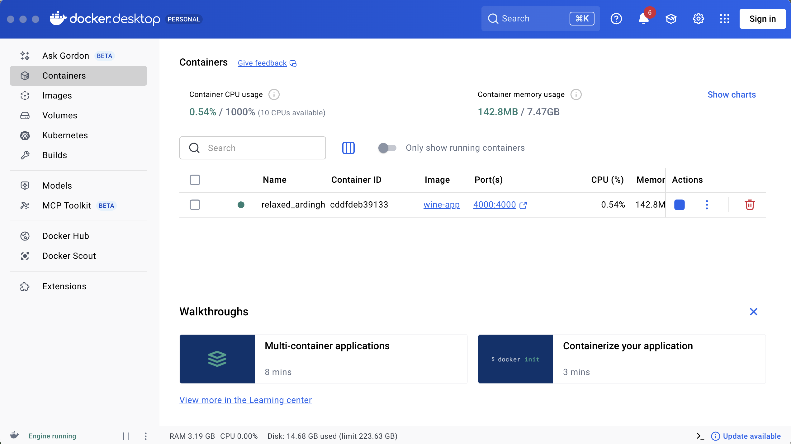
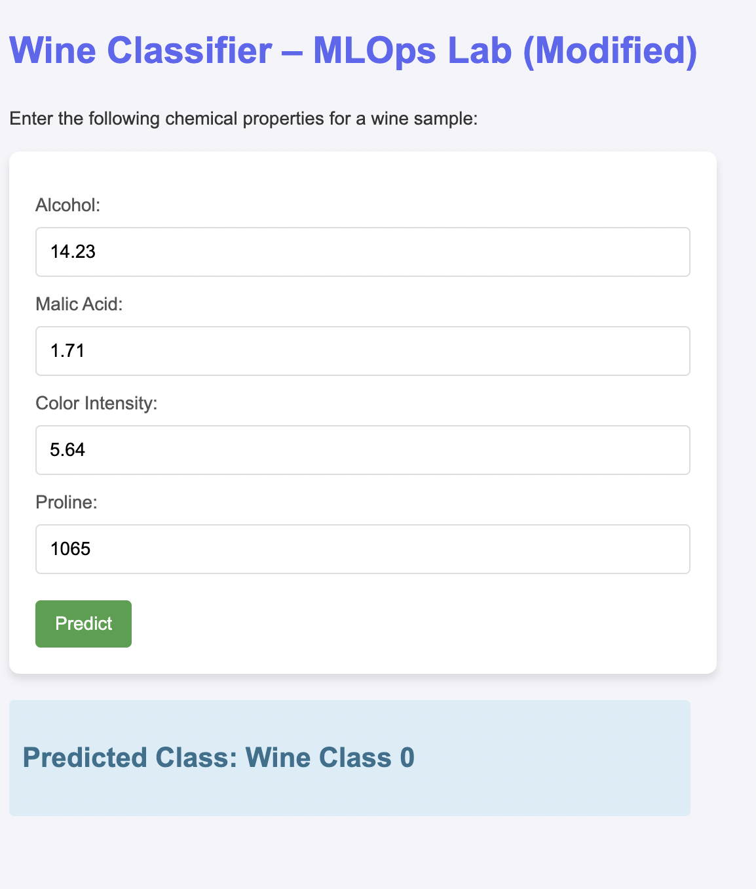
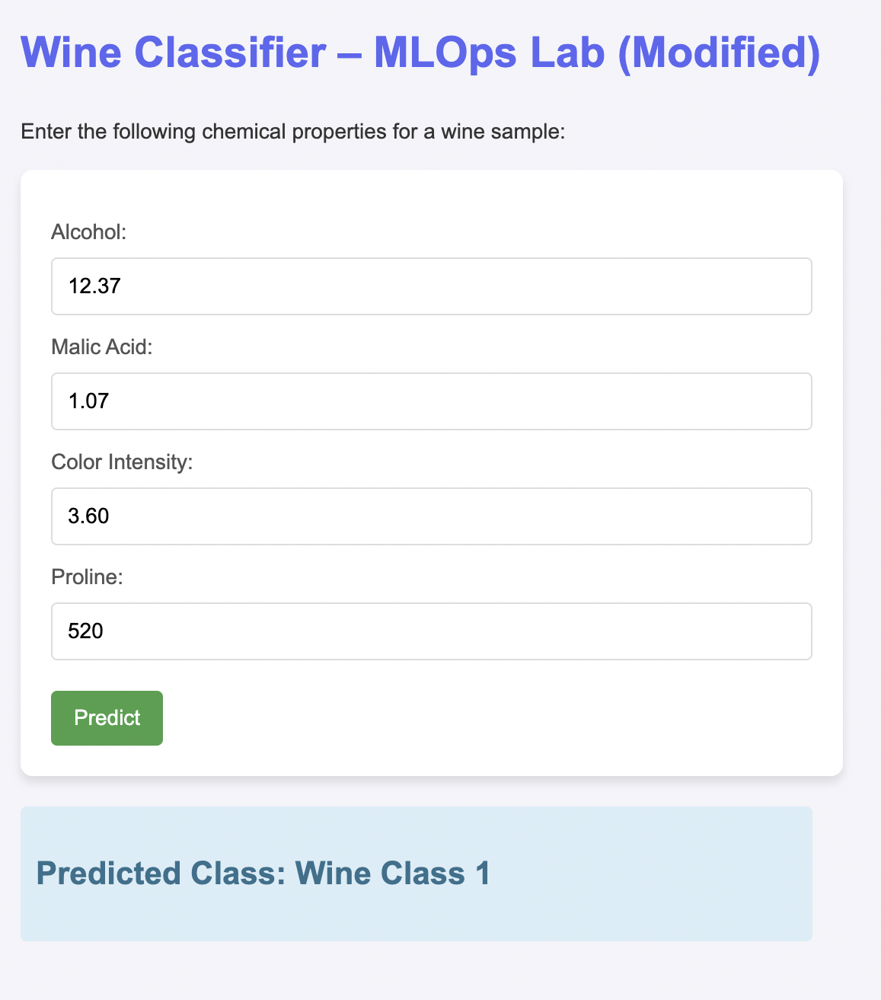

# README — MLOps Docker Lab (Wine Classifier App)

## Overview

This project is my submission for the MLOps Docker Lab. The goal of the lab is to containerize a machine learning application using Docker so it can be run independently of the local environment.


---

## Project Description

This app trains a RandomForest model to classify wines using 4 features:

* **Alcohol**
* **Malic Acid**
* **Color Intensity**
* **Proline**

The trained model is saved as:

```
model/wine_model.pkl
```

A Flask API loads the model and provides a `/predict` route that accepts user inputs from a simple HTML form and returns the predicted wine class.

---

## Local Setup 

If you want to run the project normally:

### 1. Create virtual env

```bash
python3 -m venv venv
source venv/bin/activate
```

### 2. Install dependencies

```bash
pip install -r requirements.txt
```

### 3️. Train the model locally

```bash
python src/model_training.py
```

### 4️. Run the Flask app

```bash
python src/main.py
```

Open: http://localhost:4000

---

## Running the App Inside Docker 

The project uses a multi-stage Docker build:

* **Stage 1:** build model and save `wine_model.pkl`
* **Stage 2:** install runtime dependencies and serve via Flask

### 1️. Build the Docker image

```bash
docker build -t wine-app .
```

### 2️. Run the Docker container

```bash
docker run -p 4000:4000 wine-app
```

You should see logs like:

```
 * Serving Flask app 'src.main'
 * Running on http://0.0.0.0:4000
```

### 3️. Access the running container

Open your browser:

 http://localhost:4000

---

##  Screenshots (Proof of Docker Execution)

###  Screenshot 1 — Docker container running



This shows Docker Desktop with the container running the image `wine-app` on port `4000:4000`.

###  Screenshot 2 — Terminal running the container


Shows `docker run -p 4000:4000 wine-app` and the Flask logs.

###  Screenshot 3— App running in Browser





Shows that the containerized Flask app is accessible at http://localhost:4000 and accepts inputs for prediction.


---

## Project Structure

```
Lab5_Docker/
│
├── dockerfile
├── requirements.txt
├── HOWTO
│
├── src/
│   ├── main.py              # Flask app
│   ├── model_training.py    # Wine dataset model training
│   ├── templates/
│       └── predict.html
│── statics/
│      |── (images)
│
└── model/
      └── wine_model.pkl     # Created automatically during Docker build
```

---


## Conclusion

This project demonstrates:

* ML model training
* API development using Flask
* Multi-stage Docker images
* Containerized ML inference
* Reproducible deployment

The final result is a fully functional **Wine Classifier web app** running inside Docker.
